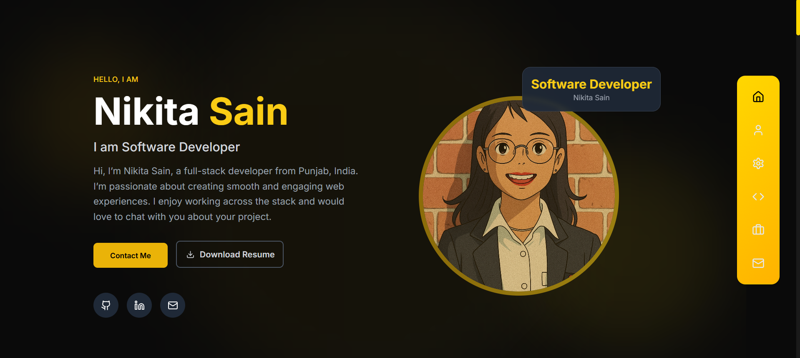
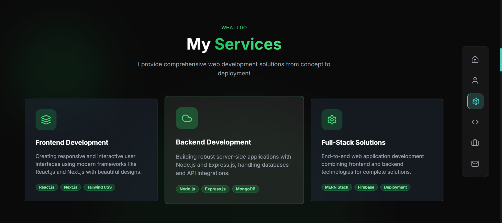
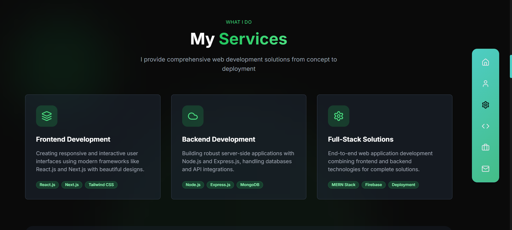
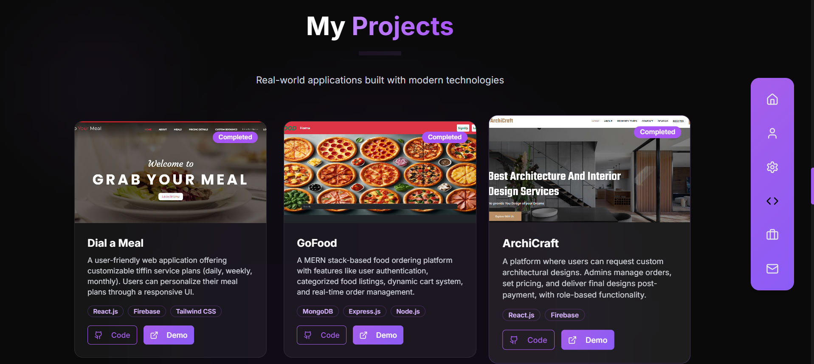

🌐 Nikita Sain – Portfolio

This is my personal portfolio website built with Next.js.
It showcases my projects, skills, and experience as a Full Stack Developer.

🔗 Live Demo: nikita-sain-portfolio.vercel.app

✨ Features

🚀 Built with Next.js (App Router)

🎨 Styled using Tailwind CSS

📱 Fully Responsive Design

🌗 Smooth animations & transitions

📂 Projects showcase with live demo & GitHub links

📞 Contact section with email integration

📄 Downloadable Resume

🛠️ Tech Stack

Frontend: Next.js, React, Tailwind CSS

Animations: Framer Motion / GSAP (if you used)

Deployment: Vercel

📸 Screenshots

  
  
   
  
  

🚀 Getting Started

Follow these steps to run the project locally:

## Clone the repository

git clone https://github.com/NikitaSain20/Nikita-Sain-Portfolio

## Navigate to project folder

cd portfolio

## Install dependencies

npm install

## Start development server

npm run dev

Now open http://localhost:3000
in your browser.

📬 Contact

If you’d like to connect, feel free to reach out:

Email: nikitasen664@gmail.com

LinkedIn: linkedin.com/in/nikita-sain

GitHub: github.com/Nikita-Sen

⭐ If you like this portfolio, consider giving it a star on GitHub!
